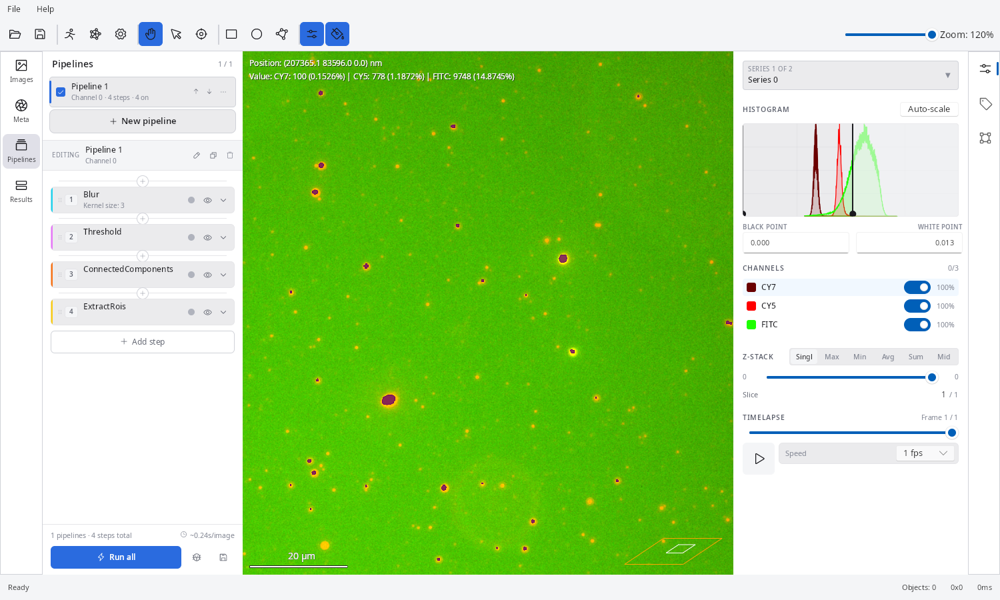

# EVAnalyzer
***Enhances Visual Analyzer***

<div align="center">

[](https://imagec.org/about_imagec)
[](https://github.com/evanalyzer/evanalyzer/actions/workflows/release.yml)
[](https://github.com/evanalyzer/evanalyzer/releases/latest)
[](#license)
[](https://www.rust-lang.org/)
[](#building)

**A high-performance bioimage analysis desktop application written in Rust.**

EVAnalyzer is the Rust reimplementation of [ImageC](https://github.com/imagec) and the successor of the [EVAnalyzer ImageJ plugin](https://github.com/evanalyzer/evanalyzer-ij), combining a high-performance image viewer with a configurable analysis pipeline for fluorescence microscopy and high-content screening data.



</div>

---

## Features

| | |
|---|---|
| **40+ file formats** | CZI, ND2, LIF, VSI, OME-TIFF, SLD, SCN, and more via [Bio-Formats](https://www.openmicroscopy.org/bio-formats/) |
| **Multi-channel viewer** | Per-channel brightness/contrast, visibility toggles, and colour assignment |
| **Z-stack support** | Single-plane selection or intensity projections (Max, Min, Average, Sum, Middle) |
| **Time-lapse support** | Playback through T-stack sequences at configurable frame rates |
| **ROI annotation** | Rectangle, oval, and polygon regions of interest drawn directly on the image |
| **ROI classification** | Object classes with custom colours, names, and measurement criteria |
| **Analysis pipeline** | Composable processing steps from a library of algorithms (see below) |
| **Multi-well plate layout** | Group images by well/plate for high-content screening experiments |
| **CSV export** | Pipeline results exported per image and per well |
| **Whole slide images** | Native support for whole slide image formats |
| **Navigator minimap** | Thumbnail overview with visible viewport indicator |
| **Scale bar** | Physical scale bar with configurable units (nm, µm, mm) |
| **Cross-platform** | Linux (Skia renderer) and Windows (software renderer) |

### Analysis Pipeline Algorithms

| Category | Algorithms |
|---|---|
| **Filters** | Gaussian blur, rank filter (min/median/max), rolling-ball background subtraction, enhance contrast, colour filter, intensity transform, Canny/Sobel edge detection, Hessian, Laplacian, structure tensor, weighted deviation |
| **Segmentation** | Manual & automatic thresholding, connected components, watershed |
| **Morphology** | Dilation, erosion, opening, closing |
| **Classification** | Rule-based object classification with configurable measurements |

---

## Architecture

The workspace is organised into focused crates:

| Crate | Description |
|---|---|
| `evanalyzer_core` | Image I/O (Bio-Formats via JVM), processing algorithms, ROI model, pipeline execution |
| `evanalyzer_cfg` | Project settings, serialisation to JSON, pipeline command configuration |
| `evanalyzer_app` | Application handle, shared project state |
| `evanalyzer_gui` | Slint-based desktop GUI — viewport, histogram, ROI tools, classification panel |
| `evanalyzer_cli` | Command-line interface for headless batch analysis |
| `evanalyzer_bin` | Binary entry point — launches GUI or CLI depending on arguments |

### Pipeline Flow

```
[ Image ]
    │
    ▼
[ Preprocessing ]   Gaussian blur, background subtraction, edge detection, …
    │
    ▼
[ Threshold ]       Manual or automatic → binary mask
    │
    ▼
[ Connected Components ]   Label each foreground region
    │
    ▼
[ Watershed ]       Split touching objects
    │
    ▼
[ Extract ROIs ]    Assign segmentation class as the first object class
    │
    ▼
[ Classify ROIs ]   Rule-based measurement and classification (optional)
    │
    ▼
[ Export ]          CSV per image / per well
```

---

## Requirements

- **Rust** 1.80 or later (2024 edition)
- **Java JDK** 11 or later — required for Bio-Formats image reading
- **Linux** system libraries (for the GUI):
  ```sh
  apt-get install libinput10 libxkbcommon0 libfontconfig1 libgbm1
  ```

---

## Building

### Linux x86-64

```sh
cargo build-linux
```

### Windows x86-64 (cross-compile from Linux)

```sh
cargo build-win
```

> Requires [`cargo-xwin`](https://github.com/rust-cross/cargo-xwin): `cargo install cargo-xwin`

### Linux ARM64

```sh
cargo build-linux-arm
```

> Requires the cross-toolchain: `apt install gcc-aarch64-linux-gnu` and `rustup target add aarch64-unknown-linux-gnu`

---

## Supported Image Formats

EVAnalyzer reads files through Bio-Formats and supports all formats it provides. Common formats include:

| Format | Extension(s) |
|---|---|
| TIFF / BigTIFF | `.tif` `.tiff` `.btif` `.btf` |
| Zeiss CZI | `.czi` |
| Nikon ND2 | `.nd2` |
| Leica LIF | `.lif` `.lei` |
| Olympus VSI | `.vsi` |
| OME-TIFF | `.ome.tiff` |
| Slidebook | `.sld` |
| Leica SCN | `.scn` |
| JPEG | `.jpg` `.jpeg` |
| And many more | `.ics` `.fli` `.sxm` `.lim` `.oir` `.stk` `.msr` `.dm3` `.dm4` `.svs` … |

---

## Development Setup

### Toolchain

```sh
rustup component add rustfmt
cargo install slint-lsp      # Language server for .slint files
cargo install slint-viewer   # Live preview of .slint files
```

### Previewing the UI inside a container

Allow X11 forwarding on the host before starting the container:

```sh
xhost +local:docker
```

### Code Coverage

```sh
cargo install cargo-llvm-cov
rustup component add llvm-tools-preview

cargo llvm-cov                                    # terminal report
cargo llvm-cov --html                             # HTML report → target/llvm-cov/
cargo llvm-cov --lcov --output-path lcov.info    # lcov format (e.g. VS Code Coverage Gutters)
```

---

## Testing

```sh
cargo test
```

---

## UI Performance Targets

| Action | Target | Rationale |
|---|---|---|
| Pan / drag | < 10 ms | Must feel attached to the cursor |
| Zoom | < 16 ms | Prevents motion sickness |
| Channel toggle | < 100 ms | Perceived as instant |
| Auto-adjust | < 200 ms | Acceptable for a complex calculation |

---

## Contributing

Contributions are welcome. Please open an issue before submitting large changes so the direction can be agreed on first.

1. Fork the repository
2. Create a feature branch: `git checkout -b feat/my-feature`
3. Commit your changes
4. Open a pull request

---

## License

EVAnalyzer is dual-licensed:

| Use case | License |
|---|---|
| Personal, academic, and non-commercial use | [AGPL-3.0](https://www.gnu.org/licenses/agpl-3.0) — free, source must remain open |
| Commercial use | [PolyForm Commercial License](LICENSE-COMMERCIAL) — contact us for terms |

If you integrate EVAnalyzer into a commercial product or service, or distribute it as part of a commercial offering, a commercial license is required.  
For commercial licensing enquiries, please open an issue or contact the maintainer directly.

---

## Acknowledgements

- [Bio-Formats](https://www.openmicroscopy.org/bio-formats/) — Open Microscopy Environment
- [Slint](https://slint.dev/) — cross-platform UI toolkit for Rust
- [Kornia-rs](https://github.com/kornia/kornia-rs) — computer vision primitives in Rust
- [Skia](https://skia.org/) — 2D graphics renderer
- [DuckDB](https://duckdb.org/) — in-process analytical database
