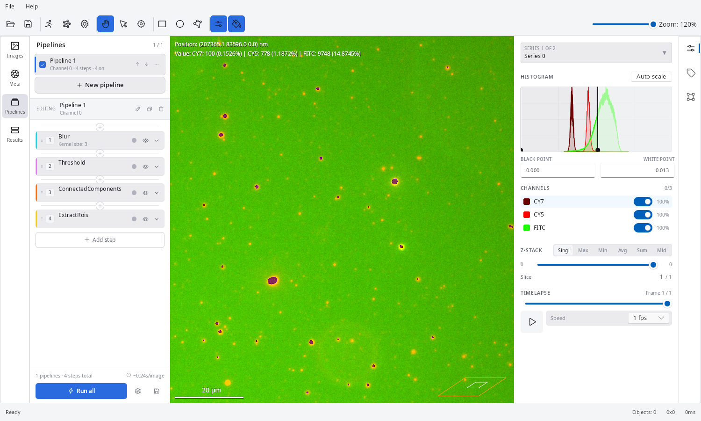

# EVAnalyzer
***Enhances Visual Analyzer***

<div align="center">

[](https://imagec.org/about_imagec)
[](https://github.com/evanalyzer/evanalyzer/actions/workflows/release.yml)
[](https://github.com/evanalyzer/evanalyzer/releases/latest)
[](#license)
[](https://www.rust-lang.org/)
[](#installing-a-release)

**A high-performance bioimage analysis desktop application written in Rust.**

EVAnalyzer is the Rust reimplementation of [ImageC](https://github.com/imagec) and the successor of the [EVAnalyzer ImageJ plugin](https://github.com/evanalyzer/evanalyzer-ij), combining a high-performance image viewer with a configurable analysis pipeline for fluorescence microscopy and high-content screening data.



</div>

---

## Features

| | |
|---|---|
| **40+ file formats** | CZI, ND2, LIF, VSI, OME-TIFF, SLD, SCN, and more via [Bio-Formats](https://www.openmicroscopy.org/bio-formats/) |
| **Multi-channel viewer** | Per-channel brightness/contrast, visibility toggles, and colour assignment |
| **Z-stack support** | Single-plane selection or intensity projections (Max, Min, Average, Sum, Middle) |
| **Time-lapse support** | Playback through T-stack sequences at configurable frame rates |
| **ROI annotation** | Rectangle, oval, and polygon regions of interest drawn directly on the image |
| **ROI classification** | Object classes with custom colours, names, and measurement criteria |
| **Analysis pipeline** | Composable processing steps from a library of algorithms (see below) |
| **Multi-well plate layout** | Group images by well/plate for high-content screening experiments |
| **CSV export** | Pipeline results exported per image and per well |
| **Whole slide images** | Native support for whole slide image formats |
| **Navigator minimap** | Thumbnail overview with visible viewport indicator |
| **Scale bar** | Physical scale bar with configurable units (nm, µm, mm) |
| **Cross-platform** | Linux (Skia renderer) and Windows (software renderer) |

### Analysis Pipeline Algorithms

| Category | Algorithms |
|---|---|
| **Filters** | Gaussian blur, rank filter (min/median/max), rolling-ball background subtraction, enhance contrast, colour filter, intensity transform, Canny/Sobel edge detection, Hessian, Laplacian, structure tensor, weighted deviation |
| **Segmentation** | Manual & automatic thresholding, connected components, watershed, AI segmentation (Stardist, U-Net — requires the `ai` build feature) |
| **Morphology** | Dilation, erosion, opening, closing |
| **Classification** | Rule-based object classification with configurable measurements |

### AI Segmentation

Two AI segmentation algorithms are available (built with the `ai` Cargo feature, via [tch-rs](https://github.com/LaurentMazare/tch-rs)/libtorch):

| Algorithm | What the model predicts | What you get |
|---|---|---|
| **Stardist** | Star-convex polygon parameters per grid cell | Separated object instances directly — no further steps needed |
| **UNet** | Per-pixel semantic mask | A single foreground mask — touching objects are **not** separated yet |

#### Using `UNet` correctly

`UNet` only produces a semantic mask (foreground vs. background); it has no notion of individual object instances. Getting good results requires two things:

1. **Match `output_mode`/`foreground_channel` to your model's export.**
   - **Plain background/foreground classifier** (a mutually-exclusive softmax head): use `output_mode: SoftmaxClasses` and set `foreground_channel` to the foreground class index (usually `1` for a 2-class head — this is the default).
   - **Boundary-aware model** (e.g. bioimage.io nucleus-boundary models, which export an independent mask channel *and* a separate boundary channel — these are two unrelated probabilities, not softmax classes): use `output_mode: IndependentChannels` and set `foreground_channel` to the mask channel's index (commonly `0`; check the model's `rdf.yaml` if unsure). Running softmax across mask+boundary, or picking the boundary channel by mistake, is the most common cause of "I get outlines, not filled objects".

2. **Separate touching objects.** `UNet` emits one shared class for "foreground", so two touching nuclei become one connected blob. How you split them depends on the model:

   - **Boundary-aware models — use the boundary channel (recommended).** Models like bioimage.io's [`affable-shark`](https://bioimage.io/#/?id=affable-shark) (*NucleiSegmentationBoundaryModel* — a U-Net, **not** StarDist) predict an explicit boundary in a second channel **specifically so you can separate touching nuclei**. Set `boundary_channel` to that channel (commonly `1`) and `boundary_threshold` (~`0.5`): a pixel is foreground only where the mask is high *and* the boundary is low, carving thin gaps between objects. Then a plain `ConnectedComponents` separates them — no watershed needed:

     ```
     UNet (foreground_channel: 0, boundary_channel: 1) → ConnectedComponents → ExtractRois
     ```

     Discarding the boundary channel and relying on watershed instead is the most common reason touching nuclei "won't split": a distance-map watershed can't separate a blob that has no waist, and the waist information lives in the boundary channel you didn't use.

   - **Mask-only models — distance-map watershed.** If the model gives only a foreground mask (no boundary), chain a watershed:

     ```
     UNet → ConnectedComponents → Watershed → ExtractRois
     ```

     `ConnectedComponents` labels each blob; `Watershed` re-splits any blob with more than one object. It's a faithful port of ImageJ's `Process > Binary > Watershed` (the `MaximumFinder` distance-map algorithm), so the default `maximum_finder_tolerance` of `0.5` works for most nuclei. Note this only works when touching nuclei actually form a pinched "peanut"; heavily overlapping nuclei with no waist cannot be split from the mask alone.

These patterns (boundary-carving, and distance-map declumping) are the standard approaches for U-Net-style models — the same ideas used by CellProfiler and ilastik. `Stardist`, by contrast, predicts per-object instances directly and skips all of this — but only genuine StarDist exports (object probability + radial distances) work with the `Stardist` command; a boundary U-Net like `affable-shark` will **not**.

---

## Architecture

The workspace is organised into focused crates:

| Crate | Description |
|---|---|
| `evanalyzer_core` | Image I/O (Bio-Formats via JVM), processing algorithms, ROI model, pipeline execution |
| `evanalyzer_cfg` | Project settings, serialisation to JSON, pipeline command configuration |
| `evanalyzer_app` | Application handle, shared project state |
| `evanalyzer_gui` | Slint-based desktop GUI — viewport, histogram, ROI tools, classification panel |
| `evanalyzer_cli` | Headless CLI: analyze projects, export/view results databases (see [Command-Line Interface](#command-line-interface-cli)) |
| `evanalyzer_bin` | Binary entry point — launches GUI or CLI depending on arguments |

### Pipeline Flow

```
[ Image ]
    │
    ▼
[ Preprocessing ]   Gaussian blur, background subtraction, edge detection, …
    │
    ▼
[ Threshold ]       Manual or automatic → binary mask
    │
    ▼
[ Connected Components ]   Label each foreground region
    │
    ▼
[ Watershed ]       Split touching objects
    │
    ▼
[ Extract ROIs ]    Assign segmentation class as the first object class
    │
    ▼
[ Classify ROIs ]   Rule-based measurement and classification (optional)
    │
    ▼
[ Export ]          CSV per image / per well
```

---

## Requirements

- **Rust** 1.80 or later (2024 edition)
- **Java JDK** 11 or later — required for Bio-Formats image reading
- **Linux** system libraries (for the GUI):
  ```sh
  apt-get install libinput10 libxkbcommon0 libfontconfig1 libgbm1
  ```

---

## System Requirements

| Resource | Minimum | Recommended |
|---|---|---|
| RAM | 4 GB | 16 GB+ (whole slide images, large batches) |
| CPU | 2 cores | 4+ cores |
| GPU | — (CPU-only build works) | NVIDIA GPU + CUDA 12.x (for the `cuda` build, AI segmentation) |
| Disk | Enough for the results database (`.evadb`) per run, plus the input images | — |

EVAnalyzer checks how much RAM is actually free at startup and scales itself
to fit: the embedded JVM (used only for Bio-Formats image reading) gets a
heap sized from that, and the number of images/tiles analyzed in parallel is
capped accordingly — so on a constrained machine it automatically falls back
to fewer parallel workers instead of running out of memory. More RAM and CPU
cores let it analyze more images/tiles concurrently, but there's no manual
tuning required to stay within what the machine actually has available.

---

## Installing a release

Prebuilt packages are attached to every [GitHub release](https://github.com/evanalyzer/evanalyzer/releases/latest). Download the archive for your platform, extract it, and run the `evanalyzer` binary — the native dependencies (libtorch, DuckDB), the bundled Java runtime and Bio-Formats all ship **inside the archive, next to the binary**, so there is nothing else to install.

### Linux x86-64 — `evanalyzer-linux-x86_64.tar.gz`

```sh
tar xzf evanalyzer-linux-x86_64.tar.gz
./evanalyzer
```

### Windows x86-64 — `evanalyzer-windows-x86_64.zip`

Unzip the archive and run `evanalyzer.exe` (keep the `.dll` files next to it).

### macOS, Apple Silicon — `evanalyzer-macos-arm64.tar.gz`

```sh
tar xzf evanalyzer-macos-arm64.tar.gz
# The build is ad-hoc signed but not notarized, so macOS Gatekeeper quarantines
# it after download. Clear the quarantine flag once, then launch it:
xattr -dr com.apple.quarantine evanalyzer
./evanalyzer
```

> Keep every file from the archive in the same folder — the bundled `.dylib`
> libraries are resolved relative to the `evanalyzer` binary.

### GPU (CUDA) builds — Linux / Windows

The CUDA builds bundle the (multi-GB) NVIDIA runtime, so they are published as
**split 7-Zip archives** (`…-cuda.7z.001`, `.002`, …) to stay under GitHub's
per-file limit. Download **all** volumes into one folder and extract with
[7-Zip](https://www.7-zip.org/) pointed at the first part:

```sh
7z x evanalyzer-linux-x86_64-cuda.7z.001     # finds .002, .003, … automatically
```

Then run the `evanalyzer` binary as for the CPU build. A matching NVIDIA driver
(CUDA 12.x) must be installed on the machine.

---

## Command-Line Interface (CLI)

Besides the GUI, the `evanalyzer` binary has a headless batch mode for scripting,
servers, and CI pipelines: `evanalyzer cli <command>`. Run `evanalyzer cli --help`
or `evanalyzer cli <command> --help` for the full flag reference — this section
covers the common workflows.

### Analyze a project

```sh
evanalyzer cli analyze --project my_project.evaproj --images /data/plate1 --threads 8
```

- `--project` — the `.evaproj` file to run (required).
- `--images` — point the project at a folder and (re-)scan it for images before
  running. Omit this to use the image list the project already has saved.
- `--threads` — images processed in parallel (default: number of CPUs minus one).

Progress is printed as `[i/total] <image>` while it runs. A new results database
(`.evadb`) is written under `results/<timestamp>__<job-name>/` next to the
project file — the same layout the GUI uses. Press **Ctrl+C** to cancel; the
in-flight image finishes, no more are started, and the process exits with code
`130`.

### Inspect a project before running it

```sh
evanalyzer cli project-info --project my_project.evaproj   # images, classes, pipelines
evanalyzer cli validate --project my_project.evaproj        # do all referenced images exist on disk?
```

Both also accept `--json` (on `project-info`) for scripting — see below.

### View a results database

```sh
evanalyzer cli view --db results/.../job.evadb --limit 50 --page 0
evanalyzer cli view --db results/.../job.evadb --image sample01.tif --class Nucleus
evanalyzer cli columns --db results/.../job.evadb   # column ids for --group-by / chart axes
```

`view` prints a quick summary (image/class counts, T/Z range) plus a page of ROI
rows — enough to sanity-check a run without opening the GUI. `columns` lists every
column id (including per-channel and colocalization-partner columns) available
for grouping and charting.

`view`, `columns`, and `project-info` all accept `--json` for machine-readable
output, e.g.:

```sh
evanalyzer cli view --db job.evadb --json --limit 100 | jq '.rows[].area_px'
```

### Export results

```sh
# CSV / XLSX, optionally grouped and aggregated
evanalyzer cli export csv  --db job.evadb --out results.csv
evanalyzer cli export xlsx --db job.evadb --out results.xlsx \
  --group-by image --agg avg,median --class Nucleus

# Charts (PNG), rendered with the same code path as the GUI's chart view
evanalyzer cli export chart histogram --db job.evadb --out area.png \
  --column area_px --buckets 30 --log-scale
evanalyzer cli export chart scatter   --db job.evadb --out scatter.png \
  --x area_px --y circularity --color-by class
evanalyzer cli export chart heatmap   --db job.evadb --out heatmap.png \
  --metric count --cell-size 256
```

All `export` and `view` subcommands accept `--image <name>`, `--class <name>`
(repeatable) and `--colocalized <true|false>` to filter rows first.

### Command summary

| Command | Purpose |
|---|---|
| `analyze` | Run a project's enabled pipelines over its images, writing a new `.evadb` |
| `project-info` | Print a project's images/classes/pipelines without running anything |
| `validate` | Check that every image a project references can be found on disk |
| `export csv` / `export xlsx` | Export a results database to a spreadsheet, optionally grouped/aggregated |
| `export chart histogram/scatter/heatmap` | Render a results database to a chart PNG |
| `view` | Print a quick summary and a page of rows from a results database |
| `columns` | List the column ids available for `--group-by` / chart axes |

---

## Building

### Linux x86-64

```sh
cargo build-linux
```

### Windows x86-64 (cross-compile from Linux)

```sh
cargo build-win
```

> Requires [`cargo-xwin`](https://github.com/rust-cross/cargo-xwin): `cargo install cargo-xwin`

### Linux ARM64

```sh
cargo build-linux-arm
```

> Requires the cross-toolchain: `apt install gcc-aarch64-linux-gnu` and `rustup target add aarch64-unknown-linux-gnu`

### macOS, Apple Silicon

```sh
cargo build-mac
```

> Build natively on an Apple-Silicon Mac. DuckDB is not bundled on macOS, so set
> `DUCKDB_LIB_DIR`/`DUCKDB_INCLUDE_DIR` to a prebuilt libduckdb (see
> `libs/download.sh mac-cpu` and the `build-macos` CI job).

---

## Supported Image Formats

EVAnalyzer reads files through Bio-Formats and supports all formats it provides. Common formats include:

| Format | Extension(s) |
|---|---|
| TIFF / BigTIFF | `.tif` `.tiff` `.btif` `.btf` |
| Zeiss CZI | `.czi` |
| Nikon ND2 | `.nd2` |
| Leica LIF | `.lif` `.lei` |
| Olympus VSI | `.vsi` |
| OME-TIFF | `.ome.tiff` |
| Slidebook | `.sld` |
| Leica SCN | `.scn` |
| JPEG | `.jpg` `.jpeg` |
| And many more | `.ics` `.fli` `.sxm` `.lim` `.oir` `.stk` `.msr` `.dm3` `.dm4` `.svs` … |

---

## Development Setup

### Toolchain

```sh
rustup component add rustfmt
cargo install slint-lsp      # Language server for .slint files
cargo install slint-viewer   # Live preview of .slint files
```

### Previewing the UI inside a container

Allow X11 forwarding on the host before starting the container:

```sh
xhost +local:docker
```

### Code Coverage

```sh
cargo install cargo-llvm-cov
rustup component add llvm-tools-preview

cargo llvm-cov                                    # terminal report
cargo llvm-cov --html                             # HTML report → target/llvm-cov/
cargo llvm-cov --lcov --output-path lcov.info    # lcov format (e.g. VS Code Coverage Gutters)
```

---

## Testing

```sh
cargo test
```

---

## UI Performance Targets

| Action | Target | Rationale |
|---|---|---|
| Pan / drag | < 10 ms | Must feel attached to the cursor |
| Zoom | < 16 ms | Prevents motion sickness |
| Channel toggle | < 100 ms | Perceived as instant |
| Auto-adjust | < 200 ms | Acceptable for a complex calculation |

---

## Contributing

Contributions are welcome. Please open an issue before submitting large changes so the direction can be agreed on first.

1. Fork the repository
2. Create a feature branch: `git checkout -b feat/my-feature`
3. Commit your changes
4. Open a pull request

---

## License

EVAnalyzer is dual-licensed:

| Use case | License |
|---|---|
| Personal, academic, and non-commercial use | [AGPL-3.0](https://www.gnu.org/licenses/agpl-3.0) — free, source must remain open |
| Commercial use | [PolyForm Commercial License](LICENSE-COMMERCIAL) — contact us for terms |

If you integrate EVAnalyzer into a commercial product or service, or distribute it as part of a commercial offering, a commercial license is required.  
For commercial licensing enquiries, please open an issue or contact the maintainer directly.

---

## Acknowledgements

- [Bio-Formats](https://www.openmicroscopy.org/bio-formats/) — Open Microscopy Environment
- [Slint](https://slint.dev/) — cross-platform UI toolkit for Rust
- [Kornia-rs](https://github.com/kornia/kornia-rs) — computer vision primitives in Rust
- [Skia](https://skia.org/) — 2D graphics renderer
- [DuckDB](https://duckdb.org/) — in-process analytical database
